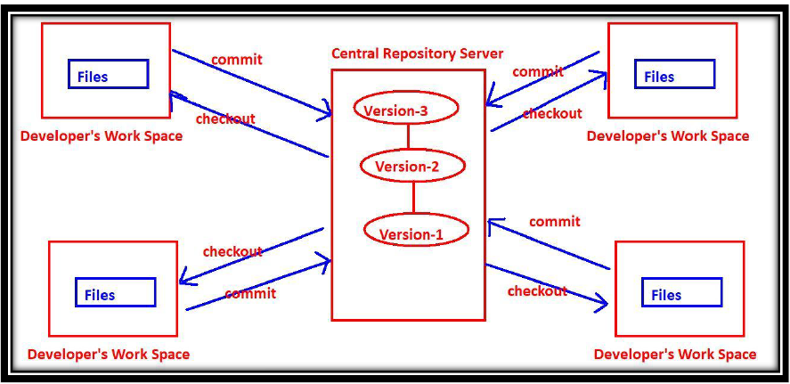
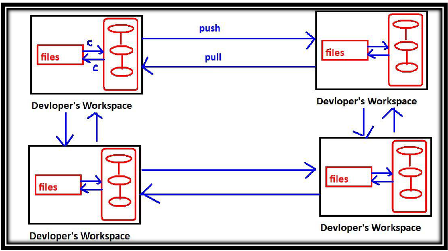

# Version Control System

---
Version Control System is the file tracking system which will track the version of file based on the changes we commit 

## The Basic Terminology of Version Control System:
* **Working Directory**: Where developers are required to create/modify files.
* **Repository**: Where we have to store files and metadata where to track the defferent version 
* **Commit**: The process of sending files from working directory to the repository.
* **Checkout**: The process of sending files from repository to working directory.
### Benefits of Version Control System: 
1) We can maintain different versions and we can choose any version based on client requirement. 
2) With every version/commit we can maintain metadata like commit message who did changes when he did the change what changes he did 
3) Developers can share the code to the peer developers in very easy way. 
4) Multiple developers can work in collaborative way 
5) Parallel development. 
6) We can provide access control like who can read code who can modify code
## Types of Version Control Systems: 
There are 2 types of VCSs 
1) Centralized Version Control System 
2) De Centralized/Distributed Version Control System

### Centralized Version Control System: 
This type of version control system contains only one central repository and every developer should be connected to that repository. The total project code will be stored in the central repository. If 4 developers are there, still we have only one repository.

### Distributed Version Control Systems: 
The name itself indicates the respository is distributed and every developers workspace contains a local copy of the repository. There is no question of central repository

#### Uses
1) The checkout and commit operations will be performed locally. Hence performance is more. 
2) To perform checkout and commit operations network is not required. Hence if there is any network outage, still version control is applicable. 
3) If something goes wrong to any repository there is a chance to recover. There is no question of single point of failure. 
4) To perform push and pull operations network must be required, but these operations are not most common operations and we are performing very rarely.

### Distributed VCS with Remote Repositoty:
The main job of remote repository is just to share our work to peer developers.

#### Uses
High availability, Speed and there is no single point of failure are main reasons for popularity of this model.

Eg: Git, Mercurial, Fossil
