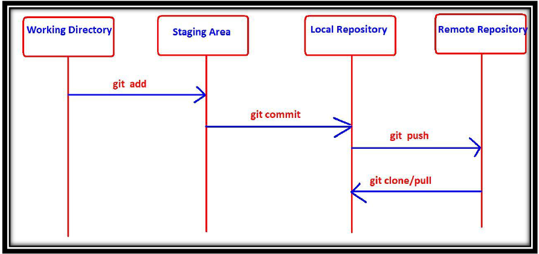

# GIT

---
### What is GIT?:
Git is Open source Distributed Version Control System Tool.

### Features of GIT:
* Every Developer has his own local repository. All the operations can be performed locally.
* All operations will be performed locally, and hence peformance is high when compared with other VCSs
* Most of operations are local. Hence we can work offline most of the times.
* There is no single point failure as Every Developer has his own local repository.
* It enables parellel development & automatic-backups.
* Git stores files in repository in some hash form, which saves space.
* We can create and work on multiple branches simultaneously
* We can merge multiple braches into a single brach.
* Moving files in GIT is very easy as GIT automatically tracks the moves.
* Freeware and Open Source
* It provides support for multiple platforms.

## GIT Architecture

**Git basic commands**
* `git add` : To add files from working directory to staging area. 
* `git commit` : To commit changes from staging area to local repository.
* `git push` : To move files from local repository to remote repository. 
* `git clone` : To create a new local repository from the remote repository. 
* `git pull` : To get updated files from remote repository to local repository
GIt contains 2 types of repositories: 
1) Local Repository
2) Remote Repository

## Life Cycle of File in GIT

### Untracked: 
The files which are newly created in working directory and git does not aware of these files are said to be in untracked state. 
### Staged: 
* The files which are added to staging area are said to be in staged state. 
* These files are ready for commit. 
### In Repository/ Committed: 
Any file which is committed is said to be In Repository/Committed State.
### Modified: 
Any file which is already tracked by git, but it is modified in working directory is said to be in Modified State.

## common Git commands used in various situations:
### start a working area (see also: git help tutorial) 
* `clone`: Clone a repository into a new directory 
* `init`: Create an empty Git repository or reinitialize an existing one
### work on the current change (see also: git help everyday) 
* `add`: Add file contents to the index 
* `mv`: Move or rename a file, a directory, or a symlink 
* `restore`: Restore working tree files 
* `rm`: Remove files from the working tree and from the index 
### the history and state (see also: git help revisions) 
* `diff`: Show changes between commits, commit and working tree, etc 
* `log`: Show commit logs 
* `show`: Show various types of objects 
* `status`: Show the working tree status
### mark and tweak your common history 
* `branch`: List, create, or delete branches 
* `commit`: Record changes to the repository
* `merge`: Join two or more development histories together 
* `rebase`: Reapply commits on top of another base tip 
* `reset`: Reset current HEAD to the specified state 
* `switch`: Switch branches 
* `tag`: Create, list, delete or verify a tag object signed with GPG
### collaborate (see also: git help workflows) 
* `fetch`: Download objects and refs from another repository 
* `pull`: Fetch from and integrate with another repository or a local branch 
* `push`: Update remote refs along with associated objects