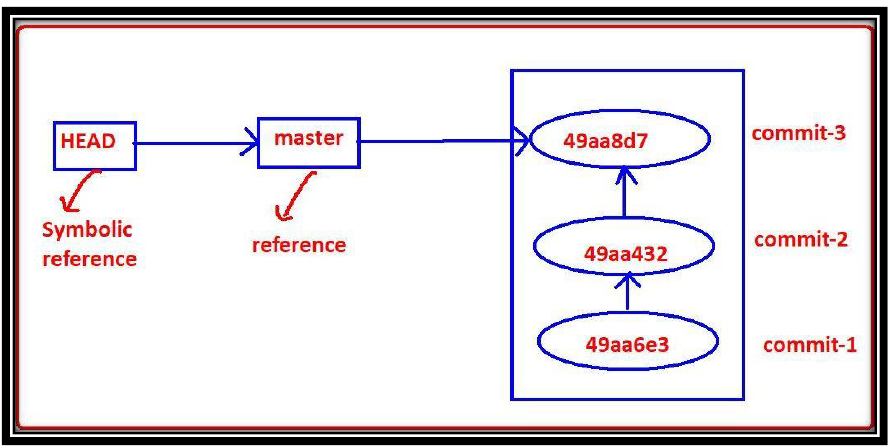

# Git References

---
Git provides some sample names for these commit ids. We can use these names directly. These are just pointers to commit ids. These sample names are called references or refs.

#### What is master?
1) master is the name of the branch. 
2) It is a reference(pointer) to last commit id. Hence where ever we required to use last commit id, simply we can use reference master. 
3) This information is available in .git/refs/heads/master file.

#### What is HEAD?

HEAD is a reference to master.
* If any reference pointing to another reference, such type of reference is called symbolic reference. Hence HEAD is symbolic reference.
* Bydefault HEAD is always pointing to branch(master).
* HEAD is stored in root of .git directory but not in .git/refs directory

#### Detached HEAD
Sometimes HEAD is not pointing to the branch name, such type of head is considered as Detached HEAD