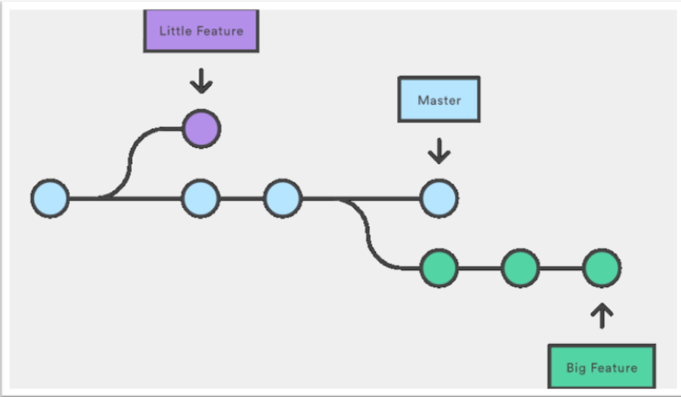
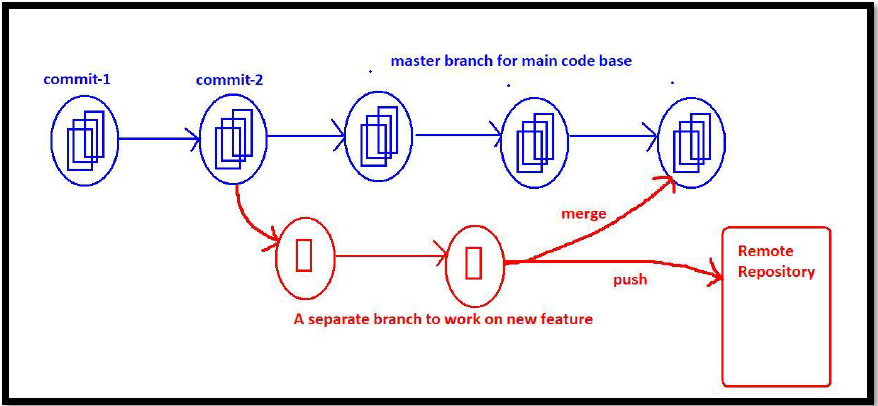
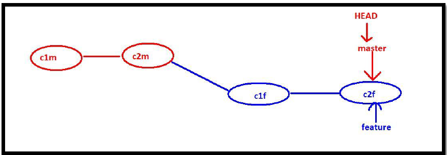
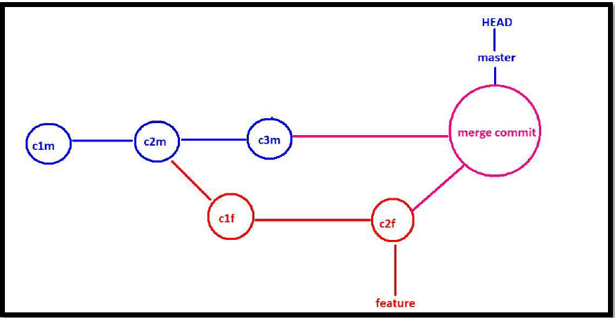

# Branching And Merging

---
## Branching
* A Branch is nothing but an independent flow of development and by using branching concept, we can create multiple work flows.

While working on real time projects code base, branching is one of mandatory and unavoidable concept.
* master branch is the default branch/ main branch in git.
* Generally main source code will be placed in master branch.
### Conclusions:
1. Once we creates a branch all files and commits will be inherited from parent branch to child branch. Branching is a logical way of duplicating files and commits. In the child branch we can create new files and we can perform new commits based on our requirements.
2. All branches are isolated to each other. The changes performed in master branch are not visible to the new branch and the changes performed in the new branch are not visible to the master branch.
3. Once the work completed in new branch then we can merge that new brach to the main branch or we can push that branch directly to the remote repository.
4. In Git, if we switch from one branch to another branch just HEAD pointer will be moved, beyond that no other work will be happend. Hence implementing branching concept is very easy and very speed.
### Commands used in branching:
* `git branch`:It will show all branches in our local repository
* `git status`: we check the status of the branch and name of the branch currently we are working
* `git branch brach_name`: create a new branch by using git branch command
* `git checkout brach_name`:Switch from one Branch to another Branch
* `git checkout -b <branchname>`:Short-cut Way to Create a New Branch and switch to that Branch

### Advantages of Branching: 
1. We can enable Parallel development. 
2. We can work on multiple flows in isolated way. 
3. We can organize source code in clean way.
4. Implementing new features will become easy
5. Bug fixing will become easy.
6. Testing new ideas or new technologies will become easy.

## Merging of a Branch

We created a branch to implement some new feature and we did some new changes in that branch, once work completed we have to merge that branch back to parent branch.
* `git merge <featurebranchname>`: used to merge feature branch into parent branch
>[!NOTE]
> 
> We have to execute this command from parent branch

### What is Fast-forward Merge

After creating child branch, if we are not doing any new commits in the parent branch, then git will perform fast-forward merge.
* In the fast-forward merge, git simply moves parent branch and points to the last commit of the child branch.
>[!NOTE]
> 
> After creating child branch if parent branch also contains some new commits, then fast-forward merge won't be happend and Three-way merge will be happed.
### What is Three-Way Merge

If changes present in both parent and child branches and if we are trying to perform merge operation, then git will do three-way merge
