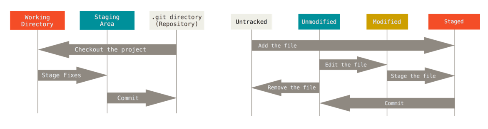

# Git_and_Github_tutorial

---
### What is version control system..?
Version control system records changes to the file or set of files over time so that you can recall specific version later 

### What is git..?
The world's most popular version control system OR free and open source distributed version control system

### What is head..?
pointer that refers to the current loactions on your repository 

### Advantages
* Track changes across multiple files
* Compare versions of projects
* Time travel back to older versions 
* revert to previous versions 
* Collaborate and share changes 
* Combine changes

### What is Github..?
Github is the service provider that hosts git repositories in the cloud

>[!NOTE]
> 
> Two ways we can interact with git `termianal` and `GUI`

### How to configure username and email 
* git config --global user.name `"VedantC"`
```commandline
git config user.name
```
* git config --global user.email `vedantchimmad@gmail.com`
```commandline
git config user.email
```
### Basic terminal commands
* `ls` : see the directory 
* `cd <dir-name>` : move into the directory 
* `start.` : opens windows popup in windows only
* `ls <folder-name>/` : see folder from the folder
* `cls` or `clear` : Clear the terminal 
* `pwd` : to see current directory 
* `cd..` : Move out from the directory 
* `mkdir <dir-name>` : Create directory 
* `rm <file-name>` : remove file
* `rm -rf <dir-name>` : remove directory
## Git repository
1. Create git repository into workspace directory by running :-> git init command
2. You can clone existing git repository from elsewhere : `git clone <url>

`

### Git commands on tracking files 
* `git status`: Is used to see the status of files (untracked and tracked)in working and staging area
* `git add <file-name>`: add files to track(tracked and staged)
* `git add -A`or`git add *`: add all new and changed files to the staging area
* `git restore --staged<file-name>`OR `git reset HEAD <file-name>'`untracked tracked files or un-staged 
* `git checkout <file-name>`:To discard changes in working directory 
* `git commit "message to commit"`:commit the staged file
* `git commit –a –m “message”` : commit directly tracked files avoiding staging 
* `git diff` : to see what you have changed in file (working directory not staged)
* `git rm Readme.md`: Remove file from staging area
* `git mv rename_from rename_to`: renaming file

### Git commands on commit:
* `git log`: too see a history of commit
* `git log –oneline`: to see history of commit in one line.
* `log –stat`: to see difference between file in each commit.
* `show <commit-hash>` :it will show metadata and content changes

### Git command Undoing
* `git commit –amend`: redo the first commit
* `reset HEAD <file-name>`: it will reset file from staging area to working directory(file in staged area)
* `git reset –hard`: branch head will move to the commit
* `git restore –staged <file-name>`: it will restore file from staging area to working directory
* `git restore <file-name>`: discard changes in working directory
* `git rebase –i <commit-hash>^`: it will drop particular commit and changes

### git remote repository
* `git remote –v`: to see remote repository URL
* `git fetch <branch-name> Or git pull <branch-name>`: It will fetch the changes from remote repository.
* `git remote rename <from>  <to>`: it will rename remote repository
* `git remote rm or remove <branch-name>`: remove repository.
* `git push <branch-name>`: push the changes into GitHub repository.
* `git switch - `: switch to previous repository
* `git branch <branch-name>`: it will create new branch from existing.
* `git switch –c <branch-name>`: it will create branch if not exist and switched to it.
* `git branch –move <existing-branch-name> <new-branch-name>`: used to rename the existing branch.

### Git Tagging
* `git tag` : it will list the existing tag
* `git tag –l “tag-name>”`: it will show the particular tag we have mentioned.
* `git tag –a “tag-name” –m “commit-message”`: create annotated tag(all the information regarding tag )
* `git tag <tag-name>`: Create lightweight tags(it will not store all the information)
* `git push origin <tag-name>`: push the tag into branch
* `git tag –d <tag-name>`: delete the tag.

### Git diff
* `git diff`: will show the files which are still not at staged
* `git diff –staged`: it will show the difference between files in the staging and latest version
* `git diff <first-branch> <second-branch>`: it will show the difference between the two branches
### git merge and rebase
* `git merge <branch-name>`: it will merge all the changes into feature branch
* `git rebase <branch-name>` : It will add the changes into next head   
### git stash
* `git stash`: it will keep the changes into feature branch without committing while switching to new feature branch 
* `git stash pop`: it will delete the stash
* `git stash apply`: apply stash changes into the current branch
* `git stash list`: get list of all stashes  
* `git stash apply stash@{2}`: It will apply particular list stash changes
* `git stash drop stash@{2}`: It will remove stash changes
* `git stash clear`: It will clear all stash list
